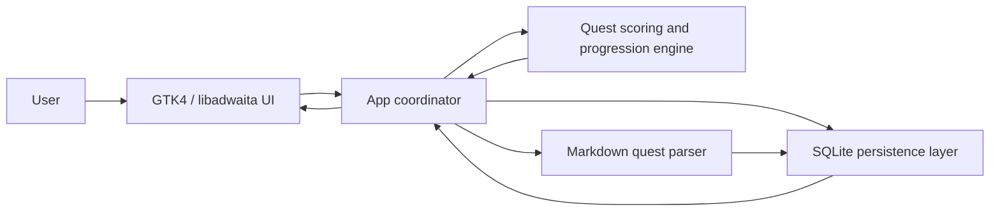

# Quests

## One-line summary

A local Python GTK4 desktop app that turns task management into RPG-style quests with XP, levels, streaks, priority sorting, tag batching, markdown import, and an Eisenhower Matrix view.

## Demo

No hosted demo is available because Quests is a local desktop application rather than a web app.

To try it locally:

```bash
python app.py
```

Typical workflow:

1. Create an adventurer profile.
2. Add quests with difficulty, importance, deadline, description, and tags.
3. Use **Magical Sorting** to generate a focused mission list.
4. Use **Batch by Tags** to group work by context.
5. View tasks on the **Eisenhower Matrix**.
6. Complete quests to gain XP, maintain streaks, and level up the character.

## Screenshots

No application screenshots are currently committed to the repository.

Recommended screenshots to add:

```markdown


```

Suggested capture set:

- Welcome / character creation screen
- Main quest log with several active quests
- Magical Sorting mission view
- Tag batching view
- Eisenhower Matrix visualization
- Character stats page after completing several quests

## Problem

Traditional todo lists are easy to ignore when the user is overloaded, distracted, or unable to decide what to do next. They usually present tasks as a flat backlog, which can create choice overload and weak reward feedback.

For ADHD-oriented task management, the core issue is not only storing tasks. The system also needs to reduce friction, provide visible progress, surface the next best task, and make small completions feel rewarding.

## Solution

Quests reframes task management as a lightweight RPG loop.

Instead of treating every item as a plain todo, the app stores each task as a **quest** with:

- difficulty: easy, medium, or hard
- importance level from 0 to 100
- optional deadline
- optional description
- optional tags
- XP reward
- completion state

The app then adds several motivation and prioritization layers:

- **XP and leveling:** completing quests grants XP and can level up the player.
- **Streak tracking:** repeated completion across days increases the reward loop.
- **Anti-grind balancing:** repeated easy tasks receive reduced reward scaling after a threshold.
- **Magical Sorting:** tasks are ranked by importance, urgency, and difficulty to create a smaller current mission list.
- **Tag batching:** quests can be grouped by their primary tag to support context-based work sessions.
- **Eisenhower Matrix:** quests are plotted visually by importance and urgency.
- **Markdown import:** users can bulk-import structured quest files instead of entering every task manually.

## Tech stack

| Area | Tools |
|---|---|
| Language | Python 3.12 |
| Desktop UI | GTK4, libadwaita, PyGObject |
| Styling | CSS loaded into GTK |
| Persistence | SQLite |
| Local database access | Python `sqlite3` |
| Architecture style | Local-first desktop app with separated UI, persistence, parsing, and scoring modules |
| Import format | Markdown quest blocks |
| Entry point | `app.py` |
| License | MIT |

## Architecture



Current source layout:

```text
.
├── app.py                  # Thin entry point that loads src/main.py
├── requirements.txt        # Python dependencies
├── src/
│   ├── main.py             # Application coordinator and event handlers
│   ├── ui_manager.py       # GTK/libadwaita window, pages, widgets, and drawing logic
│   ├── database.py         # SQLite schema, migrations, player/task persistence
│   ├── engine.py           # XP, level, streak, urgency, priority, mission, and tag-batch logic
│   ├── parser.py           # Markdown quest-file parser
│   ├── import_prompt.md    # Prompt template for generating importable quest files
│   ├── example.md          # Example quest-import file
│   ├── styles.css          # GTK CSS styling
│   └── database.db         # Local SQLite database currently present in the repo
├── knight.png              # Character visual asset
└── LICENSE
```

Runtime flow:

1. `app.py` adds `src/` to the Python path and starts `App`.
2. `App` bootstraps the SQLite database.
3. `QuestUIManager` builds the window, header, welcome state, quest list, matrix, character, and settings pages.
4. The database layer loads the current player and unfinished quests.
5. The engine enriches tasks with urgency and priority scores.
6. The UI renders the flat quest log, current mission view, tag batches, or matrix view.
7. Completing a quest updates the task state, XP, level, streak count, and character statistics.

## How to run locally

### 1. Clone the repository

```bash
git clone https://github.com/somerandomguy-coder/Quests.git
cd Quests
```

### 2. Install system GTK dependencies

Quests uses GTK4 and libadwaita through PyGObject, so it requires native GUI libraries.

On Ubuntu/Debian-based Linux:

```bash
sudo apt update
sudo apt install -y \
  python3-gi \
  python3-gi-cairo \
  gir1.2-gtk-4.0 \
  gir1.2-adw-1 \
  libcairo2-dev \
  pkg-config
```

On Fedora:

```bash
sudo dnf install -y \
  python3-gobject \
  gtk4 \
  libadwaita \
  cairo-gobject-devel \
  pkgconf-pkg-config
```

Windows support is not currently documented in the repository. For now, this project is best treated as a Linux/GTK desktop app.

### 3. Create a virtual environment

Because PyGObject often depends on system packages, a system-site-packages environment is usually the least painful setup:

```bash
python3 -m venv .venv --system-site-packages
source .venv/bin/activate
python -m pip install --upgrade pip
pip install -r requirements.txt
```

### 4. Run the application

```bash
python app.py
```

Alternative module run:

```bash
PYTHONPATH=src python src/main.py
```

### 5. Import sample quests

The repository includes a sample markdown quest file:

```text
src/example.md
```

Open the app, create a player, click the import button, and select the sample file.

## Tests

No automated test suite is currently committed.

Recommended manual smoke test:

1. Start the app with `python app.py`.
2. Create a new player.
3. Add one easy quest, one medium quest, and one hard quest.
4. Add deadlines, tags, and importance values.
5. Complete a quest and verify XP increases.
6. Verify the player level updates after enough XP.
7. Use **Magical Sorting** and confirm a current mission list appears.
8. Use **Batch by Tags** and confirm quests are grouped by tag.
9. Open the Eisenhower Matrix and hover over quest dots.
10. Import `src/example.md` and confirm valid quests appear in the list.
11. Delete the character and confirm the app returns to the welcome state.

Recommended automated tests to add:

```text
tests/
  test_engine.py      # XP gain, level-up, urgency, priority ranking, mission split
  test_parser.py      # valid import, missing fields, duplicate names, invalid dates
  test_database.py    # schema bootstrap, migrations, CRUD, completion updates
```

Useful commands after adding pytest:

```bash
pip install pytest
pytest -q
```

## Key technical decisions

- **Native desktop instead of web/Electron:** GTK4 and libadwaita keep the app lightweight and aligned with Linux desktop conventions.
- **Local-first persistence:** SQLite keeps all player and quest data on the user’s machine without requiring accounts, authentication, or a server.
- **Separated business logic:** scoring, persistence, parsing, and UI composition are split across `engine.py`, `database.py`, `parser.py`, and `ui_manager.py`.
- **Deterministic priority engine:** Magical Sorting uses explicit ranking rules instead of an opaque recommendation model.
- **Priority score design:** quests are ranked using importance, urgency, and difficulty, making the app sensitive to both user intent and deadlines.
- **Mission quota design:** the current mission selector limits the active focus set by difficulty, preventing the user from seeing the entire backlog at once.
- **RPG reward loop:** XP, levels, streaks, and difficulty multipliers are used to make task completion more visible and rewarding.
- **Anti-grind penalty:** repeated easy completions eventually reduce XP scaling, which nudges the user away from farming only low-effort tasks.
- **Markdown import format:** bulk task entry is handled through human-readable markdown rather than JSON or a database dump.
- **Eisenhower Matrix visualization:** tasks are plotted into a familiar prioritization framework using importance and urgency.

## Results / metrics

Current implementation status:

| Area | Status |
|---|---|
| Local GTK desktop UI | Implemented |
| Character creation | Implemented |
| Quest creation | Implemented |
| Difficulty tiers | Implemented |
| XP and level progression | Implemented |
| Streak tracking | Implemented |
| SQLite persistence | Implemented |
| Schema migration support | Implemented |
| Markdown quest import | Implemented |
| Magical Sorting | Implemented |
| Tag batching | Implemented |
| Eisenhower Matrix view | Implemented |
| Light/dark theme toggle | Implemented |
| Automated tests | Not yet implemented |
| Packaged release | Not yet implemented |
| Usability study / retention metrics | Not yet measured |

Formal product metrics are not currently documented. Recommended metrics to add later:

- task completion rate before vs. after using mission sorting
- number of completed quests per day
- average backlog size
- daily/weekly active usage
- streak retention
- time from opening the app to completing the first quest
- parser import success rate
- crash-free sessions

## Limitations

- No automated tests are currently committed.
- No packaged release is available yet.
- Windows and macOS setup instructions are not documented.
- The repository currently includes a generated SQLite database file, which should usually be excluded or replaced with explicit seed data.
- The app is single-user and local-only.
- There is no sync across devices.
- There are no reminders or notifications.
- Recurrence is represented in the data model, but recurring task regeneration is not fully surfaced as a complete workflow.
- Markdown import validation exists, but there is no full import preview or correction UI.
- The Eisenhower Matrix is useful for visualization, but it is not yet an interactive drag-and-drop planning surface.
- No accessibility audit has been documented.
- No formal ADHD usability validation has been documented, so the app should be described as ADHD-friendly rather than clinically validated.

## Roadmap

- Add screenshots and a short demo GIF to the README.
- Add automated tests for the engine, parser, and database layers.
- Move `src/database.db` out of version control and add a clean seed/reset workflow.
- Package the app with Flatpak or another Linux desktop distribution method.
- Add documented setup paths for Windows and macOS if cross-platform support is a goal.
- Add quest editing and undo completion.
- Add recurring quest regeneration.
- Add import preview with per-quest validation warnings.
- Add export to markdown, JSON, or CSV.
- Add reminders or desktop notifications.
- Add keyboard shortcuts for quick capture and completion.
- Add drag-and-drop interaction on the Eisenhower Matrix.
- Add optional AI-assisted quest breakdown that outputs the existing markdown import format.
- Add accessibility review for keyboard navigation, contrast, and screen-reader labels.

## My role

I designed and implemented Quests as a local-first desktop productivity app. My work covered the GTK4/libadwaita interface, SQLite persistence model, player and quest schema, XP and level progression logic, streak and anti-grind reward balancing, priority-based mission sorting, tag batching, Eisenhower Matrix visualization, markdown quest import flow, and the overall app coordination between UI, database, parser, and scoring engine.
